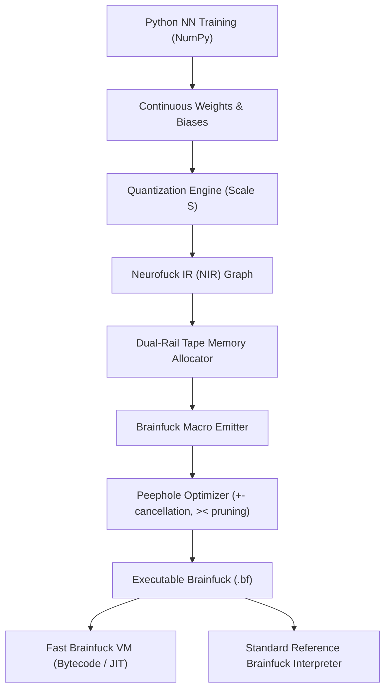

# neurofuck 🧠💻

[](https://opensource.org/licenses/MIT)
[](https://www.python.org/downloads/)
[]()

> A research and engineering project demonstrating the compilation and deterministic fixed-point execution of neural network inference in **Brainfuck**.

```
Python Trains Neural Network Normally
               ↓
     Extract Trained Weights
               ↓
    Quantize into Fixed-Point
               ↓
Neurofuck Intermediate Representation (NIR)
               ↓
Dual-Rail Memory Allocator & CodeGen
               ↓
      Peephole Optimization
               ↓
    Brainfuck Program (.bf)
               ↓
Brainfuck VM Executes Inference
               ↓
          Prediction
```

---

## 📌 Intellectual Honesty & Motivation

### Why this project exists
Modern deep learning systems rely on massive hardware abstraction stacks (CUDA, TensorRT, BLAS, specialized silicon like TPUs). While effective for throughput, this conceals the fundamental computational nature of neural inference. 

**neurofuck** explores a fundamental question in theoretical computer science and compilation:

> *Can neural-network inference be compiled into the simplest possible Turing-complete computational model operating under extreme constraints (1D memory tape, 8 instructions, integer-only arithmetic, no random-access registers)?*

### What neurofuck is NOT
- **neurofuck is NOT a practical ML deployment runtime.** Brainfuck is computationally inefficient, with execution latencies orders of magnitude higher than native CPU SIMD instructions.
- The objective of this project is to demonstrate **rigorous compilation theory**, **fixed-point numerical preservation**, **dual-rail memory safety**, and **bit-exact equivalence between continuous floating-point networks and esoteric bytecode**.

---

## 🧠 Why Brainfuck is Difficult for Machine Learning

Brainfuck provides only **8 primitive instructions**: `>`, `<`, `+`, `-`, `.`, `,`, `[`, `]`. Compiling neural network workloads into Brainfuck presents formidable theoretical and engineering challenges:

1. **No Random-Access Memory**: Brainfuck has no indexed addressing ($O(1)$ array access). Accessing a variable requires explicitly shifting a 1D tape pointer step-by-step ($O(\Delta)$ pointer movements).
2. **Integer-Only Cells**: Standard Brainfuck cells store non-negative integers. Real-valued weights, negative biases, continuous activations ($\text{ReLU}, \sigma(x)$), and floating-point divisions do not exist natively.
3. **No Direct Multiplication or Division Hardware**: Multiplication ($A \times B$) must be synthesized as nested decrements and additions ($O(A \times B)$ tape steps). Division ($N // D$) must be synthesized via stateful countdown counters.
4. **No Native Signed Arithmetic or Comparisons**: Negative cell values risk underflowing unsigned integer tape representations or entering infinite loops on `[-]` clear instructions.
5. **No Call Stack or Functions**: Every operation must be inlined into a single flat linear instruction stream.

---

## 🏗️ Architecture & Compilation Pipeline

Neurofuck addresses these challenges through a multi-stage lowering pipeline:



### 1. Dual-Rail Signed Representation
Every signed value $X \in \mathbb{Z}$ is represented by a pair of non-negative physical tape cells $(X_{\text{pos}}, X_{\text{neg}})$ such that:

$$X = X_{\text{pos}} - X_{\text{neg}}, \quad X_{\text{pos}} \ge 0, \; X_{\text{neg}} \ge 0$$

- **Canonical Normalization**: An $O(X_{\text{pos}} + X_{\text{neg}})$ routine subtracts $\min(X_{\text{pos}}, X_{\text{neg}})$ from both cells, ensuring at most one cell is non-zero.
- **ReLU Activation**: After normalization, $\text{ReLU}(X)$ is achieved by a single `[-]` clear on $X_{\text{neg}}$!
- **Zero Risk of Underflow**: All cells remain strictly non-negative ($\ge 0$), guaranteeing 100% portability across 8-bit, 16-bit, 32-bit, or arbitrary-precision Brainfuck interpreters.

### 2. Fixed-Point Quantization
A continuous floating-point value $x \in \mathbb{R}$ is scaled by integer factor $S$ (default $S=16$ or $S=64$):

$$\text{Fixed}(x) = \lfloor x \cdot S + 0.5 \rfloor$$

- Dot product accumulation: $\text{Acc}_j = \sum X_i \cdot W_{ij}$ (Scale $S^2$).
- Rescaling division: $Z_j = (\text{Acc}_j // S) + B_j$ (Scale $S$).
- Hard-Sigmoid: $\sigma_{\text{hard}}(Z) = \text{clamp}\left(\lfloor \frac{Z}{4} \rfloor + \lfloor \frac{S}{2} \rfloor, 0, S\right)$.

---

## 🚀 Quickstart & CLI Usage

### Installation

```bash
# Clone repository
git clone https://github.com/your-org/neurofuck.git
cd neurofuck

# Install in editable mode
pip install -e .
```

### 1. Train a Neural Network

Train a 2-4-1 Multi-Layer Perceptron on the classic non-linear XOR problem:

```bash
neurofuck train --dataset xor --output models/xor.json --hidden 4 --epochs 5000 --lr 0.1
```

### 2. Compile Model to Brainfuck

Compile the trained JSON weights into an optimized Brainfuck program:

```bash
neurofuck compile models/xor.json --output generated/xor.bf --scale 16
```

### 3. Run Inference on Brainfuck VM

Execute single-sample inference directly on the compiled `.bf` file:

```bash
# Evaluate input [1.0, 0.0] -> Expected output: 1.0 (True)
neurofuck run generated/xor.bf --input 1.0,0.0 --scale 16

# Evaluate input [1.0, 1.0] -> Expected output: 0.0 (False)
neurofuck run generated/xor.bf --input 1.0,1.0 --scale 16
```

### 4. Verify Bit-Exact Equivalence

Rigorously verify that Python floating-point, Python quantized fixed-point, and Brainfuck execution produce **identical bit-exact predictions**:

```bash
neurofuck verify models/xor.json --dataset xor --scale 16
```

Output:
```
================================================================================
Input           | Target  | PyFloat   | PyFixed   | BF Out    | Match? 
--------------------------------------------------------------------------------
[0. 0.]         | 0       | 0.0012    | 0         | 0         | PASS   
[0. 1.]         | 1       | 0.9997    | 16        | 16        | PASS   
[1. 0.]         | 1       | 0.9997    | 16        | 16        | PASS   
[1. 1.]         | 0       | 0.0002    | 0         | 0         | PASS   
================================================================================
[+] VERIFICATION PASSED: Python fixed-point and Brainfuck VM predictions are 100% BIT-EXACT.
```

### 5. Visualize Layer Compilation

Render ASCII architectural mappings from neurons to memory tape cells:

```bash
neurofuck visualize models/xor.json --scale 16
```

---

## 📊 Benchmark Results

Benchmarking the trained XOR model ($2 \to 4 \to 1$) across execution engines:

| Metric | Python Float (Float64) | Python Quantized (Fixed-Point) | Brainfuck VM (Fast Bytecode) |
| :--- | :--- | :--- | :--- |
| **Classification Accuracy** | **100.0%** | **100.0%** | **100.0%** |
| **Latency per Sample** | $6.66 \;\mu\text{s}$ | $4.48 \;\mu\text{s}$ | $632.56 \;\text{ms}$ |
| **Bit-Exact Equivalence** | Reference | 100.0% | **100.0%** |
| **Model Size** | 136 bytes (raw float) | 34 bytes (int16) | 9,731 bytes (.bf code) |
| **Average VM Step Count**| N/A | N/A | 5,832,236 instructions |
| **Peak Tape Cells Used** | N/A | N/A | 24 cells |

---

## 🧪 Test Suite

Run the full unit and integration test suite:

```bash
python3 -m unittest discover tests
```

The test suite verifies:
- `test_nn.py`: Dense layers, backprop, numerical gradient checks, MSE/BCE loss.
- `test_quantize.py`: Scaling conversions, integer fixed-point forward passes.
- `test_serialization.py`: JSON model export/import round-trips.
- `test_ir.py`: NIR instructions, reference interpreter, graph lowering.
- `test_vm.py`: Brainfuck VM execution, infinite loop protection, pointer bounds.
- `test_emitter.py`: Macro routines for addition, multiplication, division, dual-rail normalization.
- `test_optimizer.py`: Peephole optimization rules and semantic preservation.
- `test_equivalence.py`: Python vs Brainfuck prediction equivalence and compiler determinism.
- `test_cli.py`: End-to-end command-line integration tests.

---

## ⚠️ Limitations & Future Work

### Current Limitations
1. **Computational Complexity**: Brainfuck lacks $O(1)$ multiplication. As weights and activations grow, step count scales quadratically with accumulator magnitude.
2. **Model Depth**: Deep convolutional or transformer architectures would produce millions of Brainfuck instructions and require hours per sample inference.

### Future Work
- [ ] Tree-reduction multiplication algorithms in Brainfuck.
- [ ] 2D Convolution and Pooling layer emitters.
- [ ] Compile to WebAssembly from Brainfuck.
- [ ] Hardware synthesizer compiling Brainfuck AST directly to FPGA RTL / Verilog.

---

## 📄 License

This project is licensed under the **MIT License**. See [LICENSE](LICENSE) for details.
