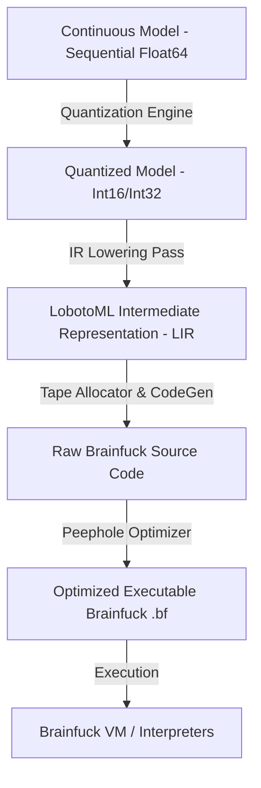

# LobotoML Compilation Pipeline

This document explains the multi-stage lowering pipeline translating high-level continuous neural network models into optimized Brainfuck bytecode.

---

## 1. Pipeline Architecture

---

## 2. Stage Breakdown

### Stage 1: Float Training & Weight Quantization
- A neural network is trained using continuous automatic differentiation and Adam optimization in Python/NumPy.
- Float64 weights $W \in \mathbb{R}^{M \times N}$ and biases $b \in \mathbb{R}^N$ are quantized into integer fixed-point values using scale factor $S$.

### Stage 2: LIR (LobotoML Intermediate Representation)
The computation is represented as a sequence of low-level instructions:
- `ALLOC`, `FREE`
- `READ_IN`, `PRINT_OUT`
- `SET`, `ADDC`, `SUBC`
- `MOV`, `CPY`, `ADD`, `SUB`, `MULC`, `DIVC`
- `RELU`, `SIGMOID`, `CLAMP`

LIR provides an executable reference model for symbolic verification before Brainfuck emission.

### Stage 3: Dual-Rail Tape Code Generation
- The tape memory manager allocates dedicated cells and scratchpad frames.
- LIR operations are expanded into parameterized Brainfuck macro routines.
- Data pointer movements are resolved into minimal relative displacements (`>` and `<`).

### Stage 4: Peephole Optimizer
The peephole optimizer removes redundant operations:
1. Cancellation of inverse pointer shifts: `><` $\to \epsilon$, `<>` $\to \epsilon$.
2. Cancellation of inverse increments: `+-` $\to \epsilon$, `-+` $\to \epsilon$.
3. Redundant clear removal: `[-][-]` $\to `[-]`$.
